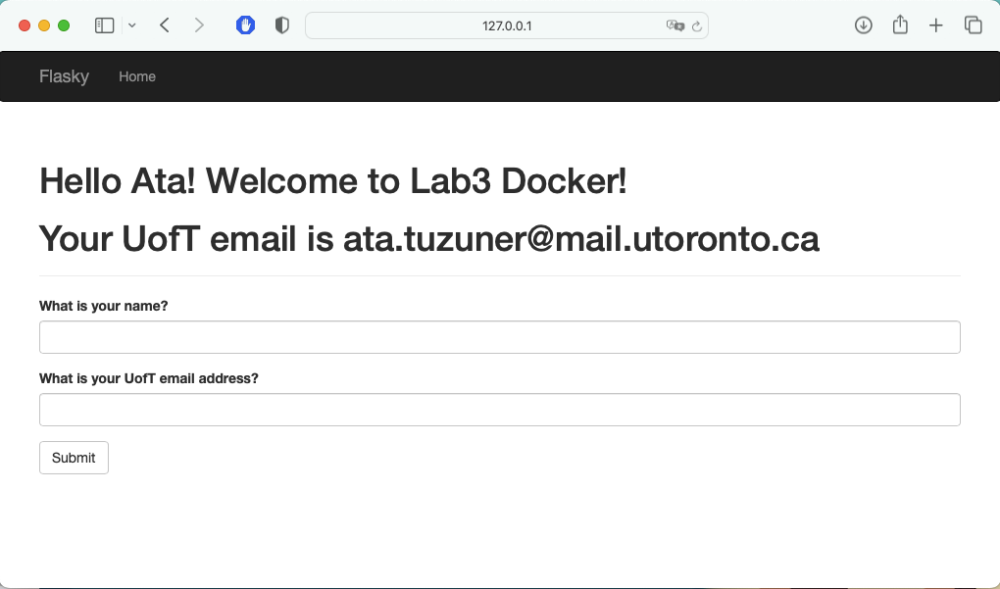

# Lab 3

## Activity 2

Installed docker.

## Activity 3

Prepped local files for Activity 4.

## Activity 4

Running Docker

### Docker Build

### Docker Run

### Docker ps (Container info)

### Application running on docker container

