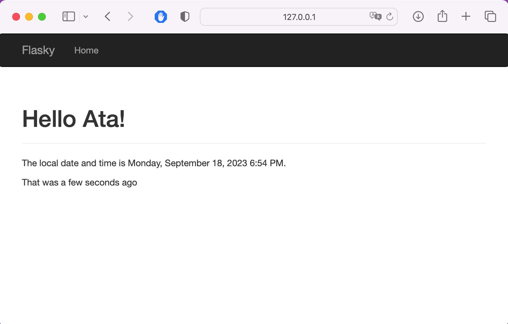

# ECE444-F2023-Lab1

Getting to know Flask

## By Ata Tuzuner

This is a clone of https://github.com/miguelgrinberg/flasky

# Activity 1

# Activity 2

## Exercise 3

## Exercise 4

# Activity 3

# Activity 4

## Exercise 1

## Exercise 2

## Exercise 3

## Exercise 4

## Exercise 5

